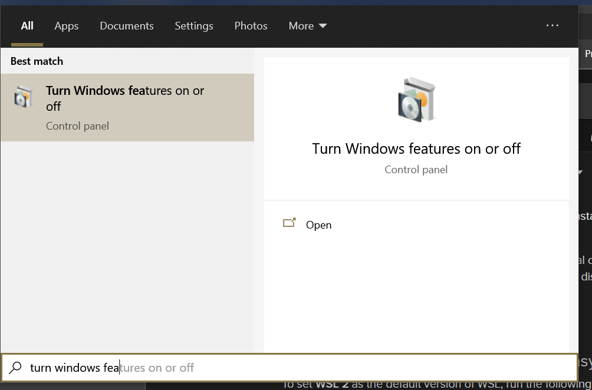
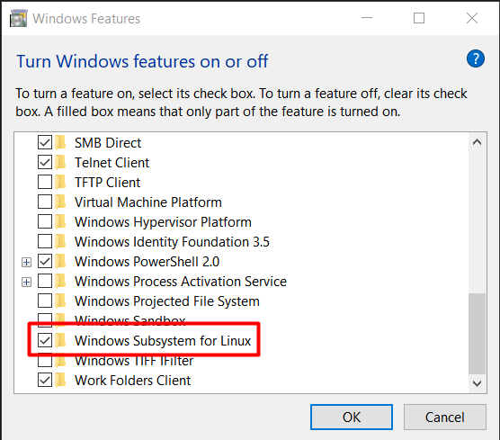
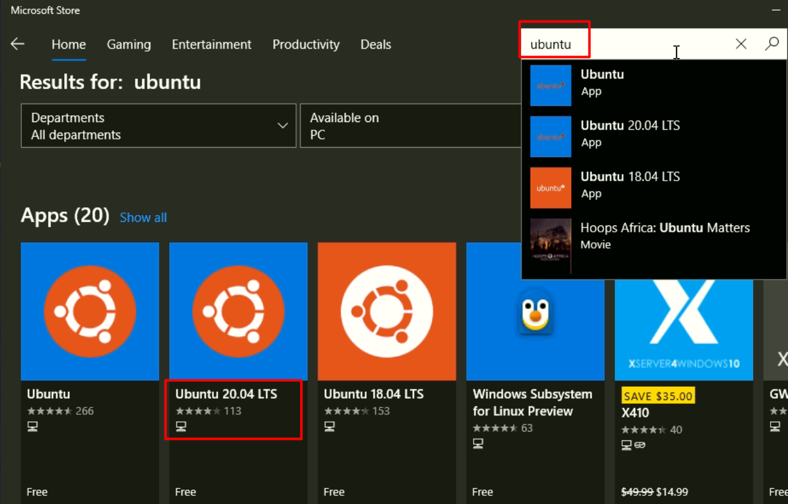
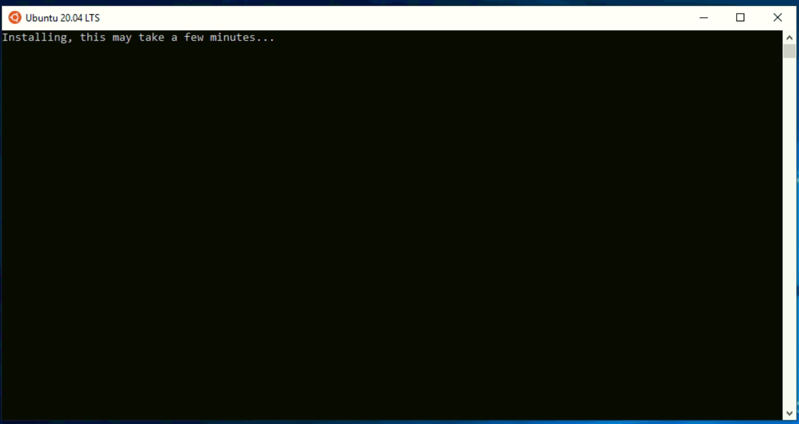

# Radfx
This is a [Next.js](https://nextjs.org/) project bootstrapped with [`create-next-app`](https://github.com/vercel/next.js/tree/canary/packages/create-next-app).

## Purpose

The goal of this project is to create a management system for scheduling particle accelerator time.


## Documentation
[link_coming]


## Required Tools
- [Node.js](https://nodejs.org/en/)
- [Github Desktop](https://desktop.github.com/)
- [A github account](https://github.com/)
- [VSCode](https://code.visualstudio.com/)

<br>
<br>

# Setup local environment + Git practices

- Make sure you have Visual Studio Code and Github Desktop Installed on your System
1. Enable WSL2 on your System



2. Reboot when asked
2. Download Ubuntu 20.04 from Microsoft Store


3. Open Ubuntu 20.04 from Start Menu

4. Wait for installation, may take a few minutes, it'll prompt you to Configure your username and password
5. Run
``` 
sudo apt update && sudo apt upgrade -y
```
```
sudo apt install git npm zip unzip -y
```

- Open Github Desktop and Sign In
- File > Clone a Repo
``` 
https://github.com/RADFXProject/FrontEnd
```
- Leave the location as default

- Select the current branch button from the top menu, **create a New Branch and publish**

- Make sure Current branch now says the name of your new branch

- You can click "Open with Visual Studio Code" but make sure you're in the **correct** repository and branch.

- As you make changes & save them in VS Code, Github Desktop will track the changes. You can **commit** to your branch as you go along.

- When you're at a stopping point, commit all your changes to your personal branch and **Push Origin** (top right), then 

- **Switch to dev branch**
- Branch > Merge into current branch

- Select your personal repo
- Create a merge commit
- **Push origin**

### **Now your changes for the day are in the dev branch**
### **When you're ready for another day/feature**

- Open Github Desktop, select your branch

**Branch > Update from dev**
- Now you've pulled all the changes from everyone else while you were gone, repeat.

<br>
<br>

## Running the front-end locally

In my case, my Windows username is "admin", yours will vary
```
cd /mnt/c/Users/admin/Documents/GitHub/FrontEnd/
```
```
npm install --legacy-peer-deps
npm run dev
```

<br>
<br>
<br>
<br>

## Want to use VS Code's built in Git section?
<details>
  <summary>Click to expand!</summary>

- No problem, but opening editor will be different. Instead of opening VS Code through Github Desktop
- Open your Ubuntu Shell and cd into your Files directory
```
cd /mnt/c/Users/admin/Documents/GitHub/FrontEnd/
```
In my case, my Windows username is "admin", yours will vary
- Once your in your working directory, run
```
code .
```
- This will open the project in VS Code, however you'll see additional information integrated into VS Code, you will need to configure Git for Windows natively (works for without it, but I cannot replicate)

</details>

<br>
<br>
<br>
<br>


## Legacy Detailed steps
<details>
  <summary>Click to expand!</summary>

## Set up your local development environment
1. Create a Github Account
2. Install Node.js
3. Install Git 
4. Install VSCode


### Get the code running on your local development environment
1. Fork the main Github Repo for the project
    1. [instructions](https://docs.github.com/en/get-started/quickstart/fork-a-repo)
2. Clone your fork in VSCode using one of the two following methods
    1. [instructions using vscode gui](https://docs.microsoft.com/en-us/visualstudio/get-started/tutorial-open-project-from-repo?view=vs-2019)
    2. terminal commands
```bash
git clone insert-your-forked-repo-location-here
cd radfx
npm install --legacy-peer-deps
npm run dev
```
3. Install your dependancies using a terminal command
```bash
npm install --legacy-peer-deps
npm run dev
```
4. Start your localhost development server using a terminal
```bash
npm run dev
```
5. Open a browser and view the site for development at [http:localhost:3000](http:localhost:3000)
"You can instantly see changes that you make to the code in your browser"
</details>

## Legacy Git CLI & VS Code Setup
<details>
  <summary>Click to expand!</summary>

### Configure user info for git if this is your first time using git on your computer
configure git by using the following commands in a terminal. replace "John Doe" wiath your name and johndoe@example.com with your email"
```bash
git config --global user.name "John Doe"\
git config --global user.email johndoe@example.com
```


### configure the upstream for your pulls for a newly cloned repository
In a terminal, cd to the root folder for the project and configure the upstream for your pulls.
```bash
git remote add upstream https://github.com/JesusPatino-stack/radfx.git
git fetch upstream
git checkout main
git merge upstream/main
git pull upstream main
```
 
### learn more about git
[game](https://learngitbranching.js.org/)  


### learn more about git in vscode
[https://code.visualstudio.com/docs/editor/github](https://code.visualstudio.com/docs/editor/github)
</details>

<br>
<br>
<br>

## Learn more about Next.js

To learn more about Next.js, take a look at the following resources:

- [Next.js Documentation](https://nextjs.org/docs) - learn about Next.js features and API.
- [Learn Next.js](https://nextjs.org/learn) - an interactive Next.js tutorial.